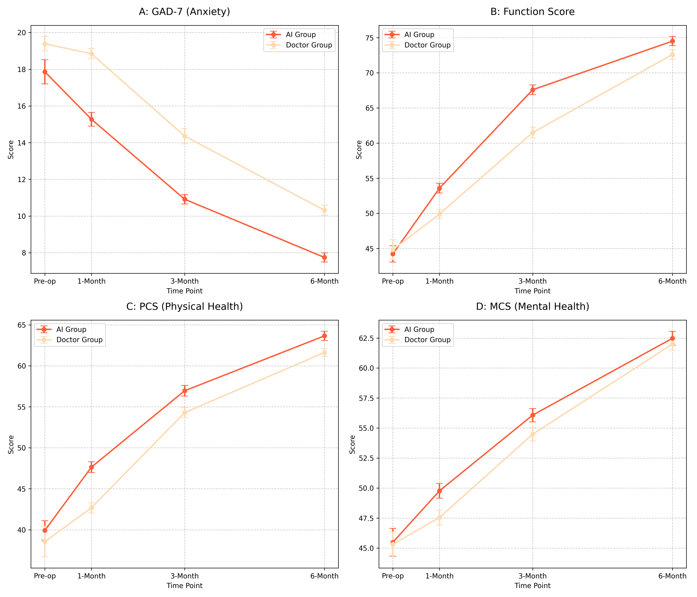
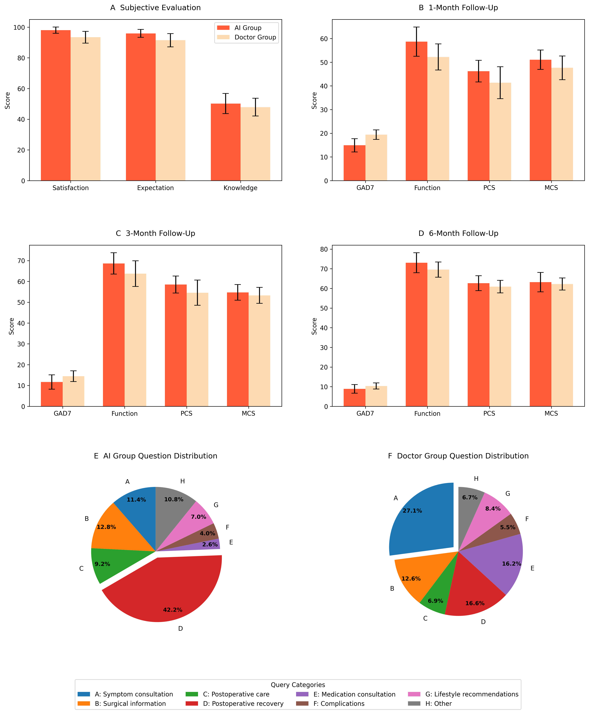
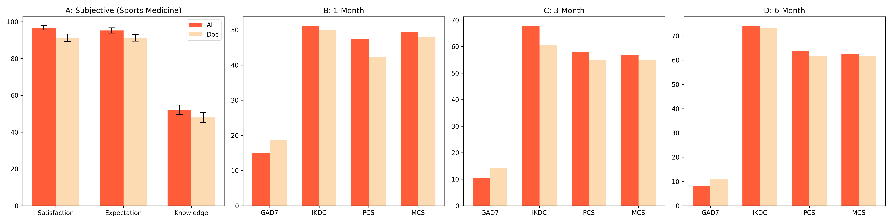
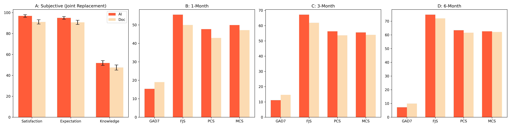
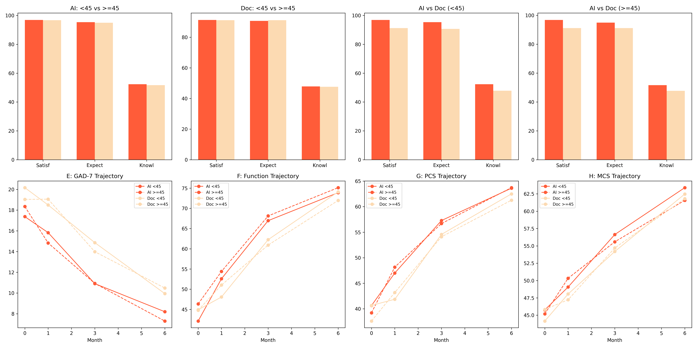

### Install requirements: 
pip install pandas numpy matplotlib seaborn scipy tabulate 
python calculate_metrics.py 
python figure2_generation.py 
python analysis_subgroups.py 
python analysis.py 

python -c "import matplotlib; import os;  
print('Matplotlib location:', os.path.dirname(matplotlib.__file__));  
print('Config directory:', matplotlib.get_configdir())

### MARKDOWN TABLE FOR REPORT:
| Metric              | AI Group (Mean ± SD)   | Doctor Group (Mean ± SD)   | P-value   |
|:--------------------|:-----------------------|:---------------------------|:----------|
| Satisfaction        | 98.01 ± 2.05           | 93.43 ± 3.87               | <0.001    |
| Expectation         | 95.94 ± 2.62           | 91.51 ± 4.34               | <0.001    |
| Knowledge_score     | 50.21 ± 6.58           | 47.89 ± 5.78               | 0.0230    |
| GAD7 (Month 6)      | 8.85 ± 2.20            | 10.35 ± 1.54               | 0.0252    |
| Function (Month 6)  | 73.05 ± 5.07           | 69.56 ± 3.87               | 0.0293    |
| PCS (Month 6)       | 62.63 ± 3.80           | 60.91 ± 3.19               | 0.1622    |
| MCS (Month 6)       | 63.17 ± 4.92           | 62.21 ± 3.07               | 0.4872    |
| Response Time (min) | 0.45 ± 0.19            | 358.71 ± 34.97             | <0.001    |
| Accuracy (%)        | 93.86 ± 1.02           | 98.14 ± 0.45               | <0.001    |

## 📊 Result Visualizations

### Figure 2: Longitudinal Outcomes (Total Cohort)

### Figure 3 & 4: Subjective Evaluation and Question Distribution

### Figure 4: Subgroup Analysis - Sports Medicine

### Figure 5: Subgroup Analysis - Joint Replacement

### Figure 6: Subgroup Analysis - Age Brackets (<45 vs ≥45)
